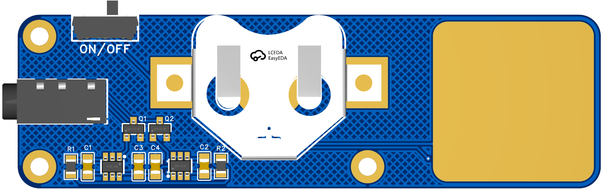
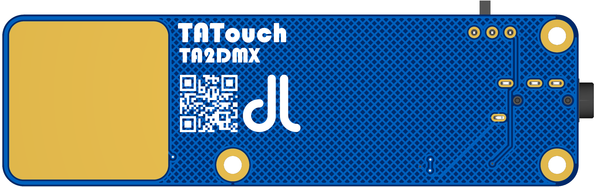
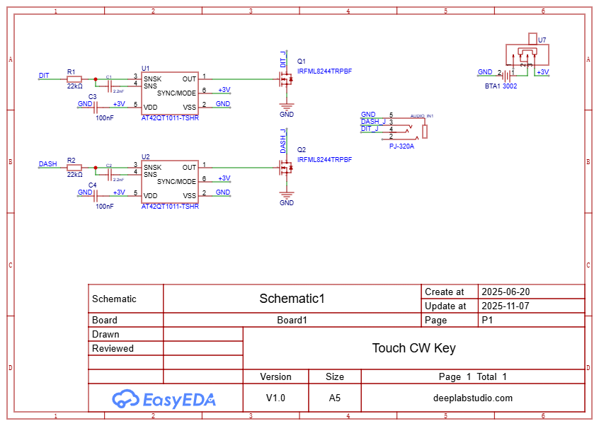

# Touch CW Key
A lightweight and elegant **touch-sensitive Iambic CW (Morse) key** powered by a **CR2032 coin cell battery**.  
It provides a modern, fully electronic keying experience with no moving parts — ideal for portable QRP setups and minimalist CW operators.  
This project focuses on simplicity, durability, and ultra-low power operation.

## PCB

  
  
  
  

---
### Schematic

---
## ⚙️ Features
- **Type:** Touch-based **Iambic CW Key**
- **Operation:** Capacitive touch sensing – no moving parts
- **Power Source:** CR2032 lithium coin cell
- **Ultra-Low Power Consumption** for long battery life
- **Output:** Logic-level or open-collector compatible output
- **Ergonomic Design:** Smooth paddles for left/right touch
- **Compact & Portable:** Perfect for field use or QRP transceivers
- **Compatible With:**  
  - Standard CW keyer circuits  
  - Microcontrollers (ESP32, Arduino, etc.)  
  - Homebrew and QRP transmitters

---
## Donate

